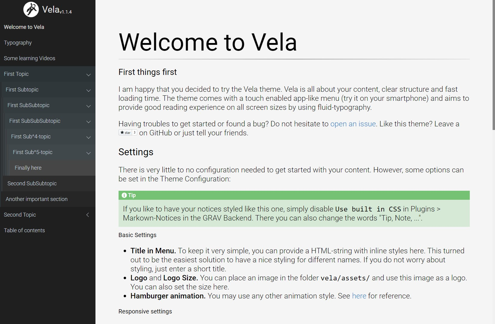

# Vela Theme

The **Vela** Theme is for [Grav CMS](http://github.com/getgrav/grav). This theme is focused on usability rather than on design and was made to present large amounts of structured content. Vela is mobile-first, but offers settings to provide a good experience on desktops too. 



## Description

A simple app-like mobile first and content-focused Grav Theme.

## Features

The theme was developed to provide learning materials and course information to students. It is focused on the content, so it is kept very simple. 

* An applike touch enabled slideout navigation.
* A structured menu for many subpages optimized for mobile using.
* No distraction, only content

## Settings

If you are using the admin panel as a backend (recommended), you can easily modify these settings under Themes > Vela. If you are not using admin, you probably know where to modify these settings directly. The theme provides several options.

##### Basic Settings

* **Title in Menu** Here you can add a title/name to appear in the top of the menu. You can also provide a HTML-string with inline styles here. 
* **Logo** You can use a logo or not. In case you like to use one, you can upload an image here to appear in the top of the menu. You can also resize your logo as desired.
* **Hamburger animation** You may use any other animation style. See [here](https://jonsuh.com/hamburgers) for reference.

##### Markdown Notices Settings

* **Markdown notice Settings** If you use the [Markdown-notices plugin](https://github.com/getgrav/grav-plugin-markdown-notices) **without** the build-in-css (disable built-in-css in plugin options), the Vela theme will automatically use its own styles for the notices. These include a small text. You can specify here, which text appears above the respective notice.

##### Responsive settings
* **Desktop Mode** If enabled, the off-canvas-menu is always open if screen is wider than the `Desktop min width` value, which can be set below. 
* **Desktop min width (pixels)** Applies only in desktop mode. If the screen width is wider than the given amount of pixels, the off-canvas menu is always open.
* **Parent pages routable in menu** If you have pages with subpages and you want these parent-pages to be accessible from the menu because you like to place content there, you can use this option. The page will only be opened, if it existis and if you do not set `routable: false` in the frontmatter of the page. Otherwise, the subpages are only expanded in the menu. **Please note: ** If you do not use Desktop Mode or - when in Desktop Mode - the screen-width is smaller then the amount set above, the menu closes each time you click a routable parent.

## Templates

To present your content, I recommend using plugins. The theme should work fine with most of them. You find plugins for many content types like images, videos or even math on [the GRAV plugins page](https://getgrav.org/downloads/plugins). Vela tries not to make any assumtions on how you present your content.

### Table of Contents

Beside a default template Vela comes with only one additional template to manually generate a decimal structured table of contents. There are plugins for this, but I often need to present a different table of content than just the structure of the website.

Just write Markdown like this to generate a decimal structure.

```
1. First part
    1. Subpart of first part
    1. Some other section
        1. Dive into this topic
        1. And stay at this level
    1. Limits and other things
    1. Applications in Science
1. Second part
    1. ...
```

which renders like:

```
1. First part
    1.1 Subpart of first part
    1.2 Some other section
        1.2.1 Dive into this topic
        1.2.2 And stay at this level
    1.3 Limits and other things
    1.4 Applications in Science
2. Second part
    ...
```

Note: Actually you dont even need this template. To generate the TOC without the template, you may simply enable markdown-extra and wrap the above markdown in a
```
<div class="toc-page" markdown="1">
...
</div>
```

# Installation

Installing the Vela theme can be done in one of two ways. Our GPM (Grav Package Manager) installation method enables you to quickly and easily install the theme with a simple terminal command, while the manual method enables you to do so via a zip file. 

## GPM Installation (Preferred)

The simplest way to install this theme is via the [Grav Package Manager (GPM)](http://learn.getgrav.org/advanced/grav-gpm) through your system's Terminal (also called the command line).  From the root of your Grav install type:

    bin/gpm install vela

This will install the Vela theme into your `/user/themes` directory within Grav. Its files can be found under `/your/site/grav/user/themes/vela`.

## Manual Installation

To install this theme, just download the zip version of this repository and unzip it under `/your/site/grav/user/themes`. Then, rename the folder to `vela`. You can find these files either on [GitHub](https://github.com/danzinger/grav-theme-vela) or via [GetGrav.org](http://getgrav.org/downloads/themes).

You should now have all the theme files under

    /your/site/grav/user/themes/vela

>> NOTE: This theme is a modular component for Grav which requires the [Grav](http://github.com/getgrav/grav), [Error](https://github.com/getgrav/grav-theme-error) and [Problems](https://github.com/getgrav/grav-plugin-problems) plugins.

# Updating

As development for the Vela theme continues, new versions may become available that add additional features and functionality, improve compatibility with newer Grav releases, and generally provide a better user experience. Updating Vela is easy, and can be done through Grav's GPM system, as well as manually.

## GPM Update (Preferred)

The simplest way to update this theme is via the [Grav Package Manager (GPM)](http://learn.getgrav.org/advanced/grav-gpm). You can do this with this by navigating to the root directory of your Grav install using your system's Terminal (also called command line) and typing the following:

    bin/gpm update vela

This command will check your Grav install to see if your Vela theme is due for an update. If a newer release is found, you will be asked whether or not you wish to update. To continue, type `y` and hit enter. The theme will automatically update and clear Grav's cache.

## Manual Update

Manually updating Vela is pretty simple. Here is what you will need to do to get this done:

* Delete the `your/site/user/themes/vela` directory.
* Download the new version of the Vela theme from either [GitHub](https://github.com/danzinger/grav-theme-vela) or [GetGrav.org](http://getgrav.org/downloads/themes).
* Unzip the zip file in `your/site/user/themes` and rename the resulting folder to `vela`.
* Clear the Grav cache. The simplest way to do this is by going to the root Grav directory in terminal and typing `bin/grav clear-cache`.

> Note: Any changes you have made to any of the files listed under this directory will also be removed and replaced by the new set. Any files located elsewhere (for example a YAML settings file placed in `user/config/themes`) will remain intact.

# Credits

Vela is inspired by the amazing [Learn2](https://github.com/getgrav/grav-theme-learn2) theme, but keeps things more simple and provides a touch enabled slideout navigation menu using [Slideout.js](https://github.com/Mango/slideout). The menu itself uses [Metismenu](https://github.com/onokumus/metismenu). Hamburger animation is provided by [Hamburgers](https://jonsuh.com/hamburgers). 

