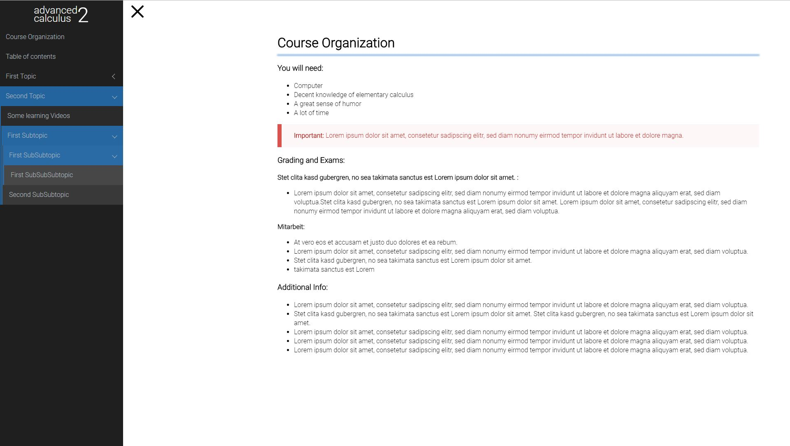

# Vela Theme

The **Vela** Theme is for [Grav CMS](http://github.com/getgrav/grav). It is inspired by the amazing [Learn2](https://github.com/getgrav/grav-theme-learn2) Theme, but keeps things more simple and provides a menu using [Slideout.js](https://github.com/Mango/slideout). The menu itself uses [Metismenu](https://github.com/onokumus/metismenu). Hamburger animation is provided by [Hamburgers](https://jonsuh.com/hamburgers).



## Description

A simple app-like mobile first and content-focused Grav Theme.

# Installation

Installing the Vela theme can be done in one of two ways. Our GPM (Grav Package Manager) installation method enables you to quickly and easily install the theme with a simple terminal command, while the manual method enables you to do so via a zip file. 

## GPM Installation (Preferred)

The simplest way to install this theme is via the [Grav Package Manager (GPM)](http://learn.getgrav.org/advanced/grav-gpm) through your system's Terminal (also called the command line).  From the root of your Grav install type:

    bin/gpm install vela

This will install the Vela theme into your `/user/themes` directory within Grav. Its files can be found under `/your/site/grav/user/themes/vela`.

## Manual Installation

To install this theme, just download the zip version of this repository and unzip it under `/your/site/grav/user/themes`. Then, rename the folder to `vela`. You can find these files either on [GitHub](https://github.com/danzinger/grav-theme-vela) or via [GetGrav.org](http://getgrav.org/downloads/themes).

You should now have all the theme files under

    /your/site/grav/user/themes/vela

>> NOTE: This theme is a modular component for Grav which requires the [Grav](http://github.com/getgrav/grav), [Error](https://github.com/getgrav/grav-theme-error) and [Problems](https://github.com/getgrav/grav-plugin-problems) plugins.

# Updating

As development for the Vela theme continues, new versions may become available that add additional features and functionality, improve compatibility with newer Grav releases, and generally provide a better user experience. Updating Vela is easy, and can be done through Grav's GPM system, as well as manually.

## GPM Update (Preferred)

The simplest way to update this theme is via the [Grav Package Manager (GPM)](http://learn.getgrav.org/advanced/grav-gpm). You can do this with this by navigating to the root directory of your Grav install using your system's Terminal (also called command line) and typing the following:

    bin/gpm update Vela

This command will check your Grav install to see if your Vela theme is due for an update. If a newer release is found, you will be asked whether or not you wish to update. To continue, type `y` and hit enter. The theme will automatically update and clear Grav's cache.

## Manual Update

Manually updating Vela is pretty simple. Here is what you will need to do to get this done:

* Delete the `your/site/user/themes/vela` directory.
* Download the new version of the Vela theme from either [GitHub](https://github.com/danzinger/grav-theme-vela) or [GetGrav.org](http://getgrav.org/downloads/themes).
* Unzip the zip file in `your/site/user/themes` and rename the resulting folder to `vela`.
* Clear the Grav cache. The simplest way to do this is by going to the root Grav directory in terminal and typing `bin/grav clear-cache`.

> Note: Any changes you have made to any of the files listed under this directory will also be removed and replaced by the new set. Any files located elsewhere (for example a YAML settings file placed in `user/config/themes`) will remain intact.

## Features

The theme was developed to provide learning materials and course information to students. It is focused on the content, so it is kept very simple. 

* An applike touch slideout navigation menu using [(slideout.js)](https://github.com/Mango/slideout)
* A structured menu for many subpages optimized for mobile using [(metismenu)](https://github.com/onokumus/metismenu)
* No distraction, only content

## Templates

### Table of Contents
Beside a default template Vela comes with only one additional template to easily generate a decimal structured table of contents. I actually did not use a template for this, but for the release I included one. If you prefer, you may use any plugin to generate a full table of contents of the page. However, I usually need to provide a different TOC of my courses for my students that basically has nothing to do with the page.

Just write Markdown like this to generate a decimal structure.

```
1. First part
    1. Subpart of first part
    1. Some other section
        1. Dive into this topic
        1. And stay at this level
    1. Limits and other things
    1. Applications in Science
1. Second part
    1. ...
```

which renders like:

```
1. First part
    1.1 Subpart of first part
    1.2 Some other section
        1.2.1 Dive into this topic
        1.2.2 And stay at this level
    1.3 Limits and other things
    1.4 Applications in Science
2. Second part
    ...
```

Actually you dont even need this template. To generate the TOC without the template, you may simply enable Markdown-Extra and wrap the above Markdown in a
```
<div class="toc-page" markdown="1">
...
</div>
```

For all content of my courses I use plugins like [MathJax](https://github.com/sommerregen/grav-plugin-mathjax) to write LaTeX, [YouTube](https://github.com/getgrav/grav-plugin-youtube) for adding Videos, ...

## Settings
Only three settings are provided:
1. Page Title shown in the Menu. To keep it very simple, you need to provide a HTML-String with inline styles here. This turned out to be the easiest solution to have a nice styling for different course names.
1. Production Mode: Use minified css (without sourcemap)
1. Hamburger Animation: You may use any other animation style. See [here](https://jonsuh.com/hamburgers) for reference.